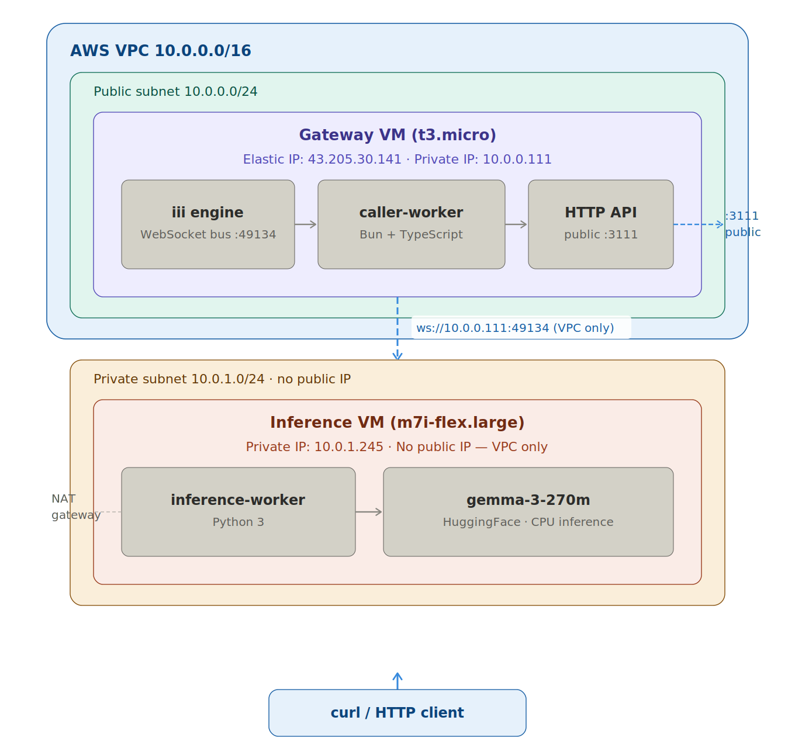

# Distributed Inference System — Alchemyst AI DevOps Assignment

A distributed inference system deployed across multiple AWS VMs using Terraform and Ansible. A Python inference worker hosts a small language model in a private subnet; a TypeScript caller-worker on the public gateway routes HTTP requests to it over WebSocket RPC.

---

## Architecture



```


Request flow
────────────
curl  →  gateway:3111  →  caller-worker
                               │  iii RPC (WebSocket, private subnet)
                               ▼
                        inference-worker
                               │  HuggingFace pipeline
                               ▼
                        gemma-3-270m generates tokens
                               │
                        {"response": "..."}  ←  bubbles back up
```

**Network hygiene**

| VM | Public IP | Ports open to internet |
|----|-----------|----------------------|
| Gateway | ✅ Elastic IP | 3111 (API), 22 (SSH, your IP only) |
| Inference | ❌ None | — (VPC only) |

The inference VM has no public IP and is reachable only through the gateway as a bastion. The iii engine WebSocket (port 49134) accepts connections from the VPC CIDR only.

---

## Repository Structure

```
alchemyst-devops/
├── README.md
├── deploy.sh                  # One-command deploy (Terraform + Ansible + test)
├── terraform/
│   ├── main.tf                # VPC, subnets, IGW, NAT gateway, route tables
│   ├── vms.tf                 # EC2 instances, Elastic IP
│   ├── security_groups.tf     # Firewall rules (gateway + inference)
│   ├── variables.tf           # Region, key name, your IP CIDR
│   └── outputs.tf             # Public IP, private IPs
└── ansible/
    ├── inventory.ini          # Update IPs after each terraform apply
    └── playbooks/
        ├── setup-gateway.yml  # iii engine + caller-worker + systemd
        └── setup-inference.yml # Python deps + inference-worker + systemd
```
 
---
 
## API
 
### Endpoint
 
```
POST http://<GATEWAY_PUBLIC_IP>:3111/v1/chat/completions
```
 
### Request schema
 
```json
{
  "messages": [
    { "role": "system",  "content": "You are a helpful assistant." },
    { "role": "user",    "content": "What is the capital of France?" }
  ]
}
```
 
### curl command
 
```bash
curl -X POST http://<GATEWAY_PUBLIC_IP>:3111/v1/chat/completions \
  -H 'Content-Type: application/json' \
  -d '{"messages":[{"role":"user","content":"What is the capital of France?"}]}' \
  --max-time 300
```
 
### Sample response
 
```json
{
  "result": {
    "response": "The capital of France is Paris.",
    "success": "You've connected two workers and they're interoperating seamlessly, now let's add a few more workers to expand this project's functionality."
  }
}
```
 
> The model is gemma-3-270m (270M parameters, CPU inference). The `success` field is emitted by the iii framework confirming the full RPC chain completed successfully.
 
---
 
## Prerequisites
 
| Tool | Version | Install |
|------|---------|---------|
| AWS CLI | any | `pip install awscli` |
| Terraform | ≥ 1.0 | [hashicorp.com](https://developer.hashicorp.com/terraform/install) |
| Ansible | ≥ 2.10 | `pip install ansible` |
| EC2 key pair | — | Create in AWS console, save as `~/.ssh/alchemyst-key.pem` |
 
Configure AWS CLI:
```bash
aws configure
# Enter your Access Key ID, Secret Access Key, region (ap-south-1), output (json)
```
 
---
 
## Option 1 — One-Command Deploy (Recommended)
 
This single script handles everything: infrastructure provisioning, worker deployment, model loading, and API test.
 
```bash
git clone <your-repo-url>
cd alchemyst-devops
chmod +x deploy.sh
bash deploy.sh
```
 
The script will:
1. Get your current public IP automatically (for SSH lockdown)
2. Run `terraform apply` — creates VPC, subnets, VMs, firewall rules
3. Run Ansible on the gateway — installs iii engine + caller-worker
4. Run Ansible on inference VM — installs Python deps + model
5. Wait 2 minutes for the model to download and load
6. Hit the API and print the response
If you see JSON output at the end, the deployment is fully working.

### Test Api
 
```bash
curl -X POST http://<GATEWAY_PUBLIC_IP>:3111/v1/chat/completions \
  -H 'Content-Type: application/json' \
  -d '{"messages":[{"role":"user","content":"What is the capital of France?"}]}' \
  --max-time 300
```
 
**To destroy everything after:**
```bash
cd terraform
terraform destroy -auto-approve
```
 
---
 
## Option 2 — Manual Step-by-Step
 
### Step 1 — Provision infrastructure
 
```bash
cd terraform
terraform init
 
terraform apply -auto-approve \
  -var "your_ip=$(curl -s https://checkip.amazonaws.com)/32"
```
 
Note the outputs:
```
gateway_public_ip    = "x.x.x.x"
inference_private_ip = "10.0.1.x"
```
 
Update `ansible/inventory.ini` with the gateway private IP (get it from AWS console or `aws ec2 describe-instances`).
 
### Step 2 — Configure SSH
 
```bash
cat >> ~/.ssh/config << 'EOF'
Host alchemyst-gateway
  HostName <GATEWAY_PUBLIC_IP>
  User ubuntu
  IdentityFile ~/.ssh/alchemyst-key.pem
  StrictHostKeyChecking no
 
Host alchemyst-inference
  HostName <INFERENCE_PRIVATE_IP>
  User ubuntu
  IdentityFile ~/.ssh/alchemyst-key.pem
  ProxyJump alchemyst-gateway
  StrictHostKeyChecking no
EOF
```
 
Test both connections:
```bash
ssh alchemyst-gateway "echo gateway ok"
ssh alchemyst-inference "echo inference ok"
```
 
### Step 3 — Deploy the gateway
 
```bash
cd ansible
ansible-playbook -i inventory.ini playbooks/setup-gateway.yml
```
 
This installs iii, clones the repo, patches the config, and starts `iii-engine` and `caller-worker` as systemd services.
 
### Step 4 — Deploy the inference worker
 
```bash
ansible-playbook -i inventory.ini playbooks/setup-inference.yml
```
 
This installs PyTorch + HuggingFace Transformers, patches the worker code, and starts `inference-worker` as a systemd service. The model downloads from HuggingFace on first boot — allow 3–5 minutes.
 
### Step 5 — Test
 
```bash
sleep 120
 
curl -X POST http://<GATEWAY_PUBLIC_IP>:3111/v1/chat/completions \
  -H 'Content-Type: application/json' \
  -d '{"messages":[{"role":"user","content":"What is the capital of France?"}]}' \
  --max-time 300
```
 
### Teardown
 
```bash
cd terraform
terraform destroy -auto-approve
```
 
---
 
## Debugging
 
**Check if services are running (SSH into the VM first):**
```bash
# On gateway
sudo systemctl status iii-engine
sudo systemctl status caller-worker
sudo journalctl -u iii-engine -f
sudo journalctl -u caller-worker -f
 
# On inference VM
sudo systemctl status inference-worker
sudo journalctl -u inference-worker -f
```
 
**Common issues:**
 
| Symptom | Likely cause | Fix |
|---------|-------------|-----|
| curl returns empty | Model still loading | Wait 2-3 min, retry |
| curl times out | `max_new_tokens` too high | Check inference_worker.py |
| `{"error":"[object Object]"}` | inference-worker not connected | Check engine URL in inference_worker.py |
| SSH refused | Wrong IP or security group | Check `terraform output` and security group rules |
 
---
 
## Hardening for Production
 
**Authentication between workers.** The iii engine currently accepts any WebSocket connection from inside the VPC. In production, add mutual TLS on port 49134 so only services presenting a signed certificate can register functions. This prevents a compromised VM in the same VPC from injecting malicious workers.
 
**HTTPS on the public API.** Port 3111 is plain HTTP. Put an AWS Application Load Balancer with an ACM certificate in front, or terminate TLS in nginx on the gateway. Never expose raw HTTP in production — prompt content travels in cleartext.
 
**Rate limiting and authentication.** The API currently accepts anonymous requests from anywhere. Add an API key check at the nginx or ALB layer, and configure rate limiting (e.g. 10 req/s per IP) to prevent abuse. AWS WAF can handle IP reputation blocking on top of that.
 
**Secrets management.** The gateway private IP is baked into Ansible inventory and systemd unit files. Move it to AWS SSM Parameter Store and inject at startup. Never commit real IPs or credentials to the repository.
 
**SSH access.** Port 22 is restricted to your IP, which is better than open, but a static home IP is fragile. Replace with AWS SSM Session Manager — no SSH port needed, access is IAM-controlled and fully logged.
 
**Monitoring.** Add a CloudWatch agent to stream systemd journal logs from both VMs. Set alarms for inference-worker crash loops and gateway 5xx rates. Without this, silent failures (model OOM, iii engine restart) go undetected.
 
**Immutable deployments.** The playbooks download the model on first boot — slow and network-dependent. Bake a golden AMI with Packer that has model weights, Python deps, and bun pre-installed. Deployment becomes a matter of swapping the AMI reference in Terraform — faster, reproducible, not dependent on HuggingFace availability.
 
---
 
## Scaling to a 100× Larger Model
 
A 100× larger model (gemma-3-27B or similar) changes almost every constraint in the current setup.
 
**GPU instances required.** The current `t3.micro` is CPU-only with 1 GB RAM. A 27B model at fp16 is ~54 GB of weights alone — it doesn't fit in RAM, let alone run at useful speed. Minimum viable instance is `g5.2xlarge` (24 GB VRAM, A10G GPU). The Terraform instance type variable is the only IaC change needed.
 
**Model loading strategy changes.** A 27B model takes 5–10 minutes to load from disk on a fresh instance — unacceptable for auto-scaling. Store weights in S3 and use a pre-warmed instance pool (never scale to zero). Alternatively bake weights into an AMI so cold-start is a disk read, not a network download.
 
**Swap the inference backend.** HuggingFace Transformers does not support continuous batching — it processes one request at a time. At scale, replace with vLLM or TensorRT-LLM, which batch concurrent requests together, achieving 10–30× higher throughput on the same hardware. The iii worker function signature stays identical; only the inference call inside changes.
 
**Horizontal scaling.** The iii engine supports multiple registered `inference::run_inference` workers and load-balances across them automatically. Add a managed instance group of inference VMs and the gateway and caller-worker need no changes — scale the inference tier independently of the API tier.
 
**Cost.** A single `g5.2xlarge` runs ~$1.20/hr on-demand. For intermittent workloads, use Spot instances with fallback to on-demand; for sustained traffic, Reserved Instances cut cost by ~40%.
 
---
 
## Tech Stack
 
| Layer | Technology |
|-------|-----------|
| Cloud | AWS (ap-south-1) |
| IaC | Terraform |
| Config management | Ansible |
| Gateway worker | TypeScript + Bun |
| Inference worker | Python 3 |
| RPC framework | iii (WebSocket mesh) |
| Model | gemma-3-270m (HuggingFace Transformers, CPU) |
| Process management | systemd |
 